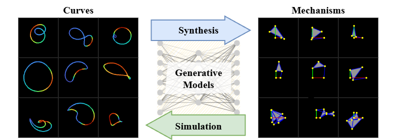
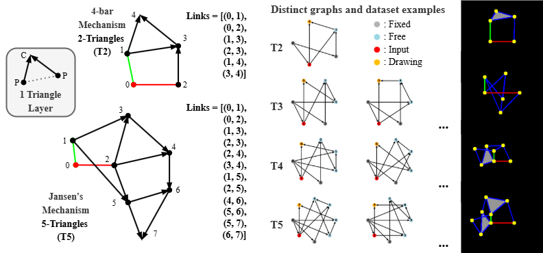

# Gen-Mech
Generative Synthesis of Kinematic Mechanisms

🌐 **[Project Website](https://jl6017.github.io/GenMech/)**



## Overview
This project implements Variational Autoencoders (VAE) for generating kinematic mechanisms from curves and vice versa. The system supports both CNN-based and Vision Transformer (ViT) based architectures for learning the relationship between mechanism curves and their corresponding linkage structures.

## Project Structure
```
GenMech/
├── model/                    # Core model components
│   ├── dataset.py           # Dataset and data loading utilities
│   ├── loss.py             # Loss functions for VAE training
│   ├── VAE_CNN.py          # CNN-based VAE implementation
│   ├── VAE_VIT.py          # Vision Transformer VAE implementation
│   ├── VIT_decoder_timm.py # ViT decoder using timm
│   └── validation.py       # Validation utilities
├── test/                    # Evaluation and testing scripts
│   ├── eval_test.py        # Model evaluation and testing
│   └── eval_plot.py        # Results visualization and plotting
├── mechanism/              # Dataset generation pipeline
├── train.py               # Main training script
└── requirements.txt       # Python dependencies
```

## Setup Instructions

### 1. Clone the Repository
```bash
git clone https://github.com/jl6017/GenMech.git
cd GenMech
```

### 2. Environment Setup
```bash
# Create a new conda environment
conda create -n genmech python=3.11

# Activate the environment
conda activate genmech

# Install PyTorch with CUDA support (adjust for your system)
conda install pytorch torchvision torchaudio pytorch-cuda=12.4 -c pytorch -c nvidia

# Install remaining dependencies
pip install -r requirements.txt
```

### 3. Data Preparation
Dataset follows this structure:



```
dataset/
├── tri_2/
│   └── images/
│       ├── curve/        # Curve images (.png)
│       └── mechanism/    # Mechanism images (.png)
├── complex_t4/
│   └── [subdirectories with same structure]
└── test_0807/
    └── [test data with same structure]
```

## Usage

### Training
```bash
# Run training with default parameters
python train.py

# The script will automatically:
# - Load data from ../dataset/ (adjust path in train.py if needed)
# - Train either ViT or CNN model (configured in script)
# - Save results and checkpoints to results/ directory
```

### Evaluation
```bash
# Run model evaluation
python test/eval_test.py

# Generate learning curve plots
python test/eval_plot.py
```

### Key Training Parameters
- **Model Type**: Switch between ViT and CNN in `train.py`
- **Dataset**: Configure `DATASET` and `DATAPATH` variables
- **Hyperparameters**: Adjust `beta`, `gamma`, `learning_rate` etc.

## Requirements
- Python 3.11+
- PyTorch 2.0+
- CUDA 12.4+ (for GPU acceleration)
- 8GB+ RAM (16GB+ recommended)
- GPU with 8GB+ VRAM (for large models)

## Citation
If you use this code, please cite:
```
[Add your citation information here]
```
